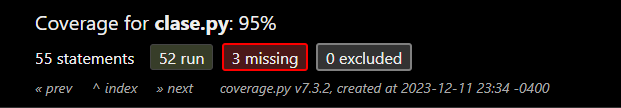

# EXAMEN 3 - CI3641

### Jeamhowards Montiel - 1910234

## Lenguaje y Herramientas Utilizados

Para la primera pregunta fue utilizado el lenguaje de programación Swift, para la segunda pregunta fue utilizado el lenguaje de programación Java,
y para la 4 y 6 pregunta fue utilizado el lenguaje de programación Python.

## Códigos fuentes

Para cada pregunta, su código fuente se encuentra dentro de su carpeta correspondiente en la carpeta src. Por ejemplo, para la pregunta 1 el código fuente está en

```
./pregunta-1
```

## Cómo ejecutar el programa

### Primera Pregunta (Swift)

1. Escribe en tu consola el siguiente comando

```
swiftc ./pregunta-1/pregunta-1.swift
```

### Segunda Pregunta (Java)

1. Escribe en tu consola el siguiente comando

```
make run
```

Esto compilará el programa y lo ejecutará. Preguntará por cual de los dos programas se desea ejecutar, y luego preguntará 
cuál programa de la pregunta 2 quiere ejecutar.

### Cuarta Pregunta (Python)

1. Escribe en tu consola el siguiente comando

```
cd ./pregunta-4
```

2. Luego, escribe el siguiente comando

```
python main.py
```

Puede acceder también a las pruebas unitarias de la cuarta pregunta, para ello escriba en su consola el siguiente comando

```
python tests.py
```

Por último puede acceder al informe de cobertura de las pruebas unitarias, para ello abra en su navegador web el archivo index.html que se encuentra en la carpeta htmlcov

```
./htmlcov/index.html
```

Se anexan imagenes del informe



### Sexta Pregunta (Python)

1. Escribe en tu consola el siguiente comando

```
cd ./pregunta-6
```

2. Luego, escribe el siguiente comando

```
python main.py
```


